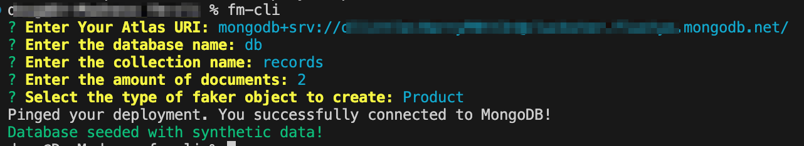

# Create Fake Data in MongoDB cluster for local development

FM-CLI is a command line tool that lets you seed your mongodb cluster with fake data from [FakerJS](https://fakerjs.dev/api/). Check out the [GUI version here](https://github.com/dl-little/faker-maker):

There are 5 document types with sensible default keys:

- Product:
<pre>
_id: ObjectId('66a14d776162460f1bb057a5')
department: Industrial
isbn: 978-1-4698-6728-1
price: $184.00
product: Fantastic Wooden Fish
description: Ergonomic executive chair upholstered in bonded black leather and...
material: Frozen
</pre>

- User:
<pre>
_id: ObjectId('66a14d776162460f1bb057a5')
name: Shelly Feest
email: ShellyFeest92@hotmail.com
phoneNumber: 1-311-467-6420 x227
city: Alafaya
state: NE
country: United States
address: 38206 Celestine View
secondaryAddress: Apt. 611
fullAddress: 38206 Celestine View, Apt. 611, Alafaya, NE 65389-3252
</pre>

- Employee:
<pre>
_id: ObjectId('66a14d776162460f1bb057a5')
name: Roman Daugherty
position: Corporate Configuration Representative
descriptor: Legacy
area: Brand
level: Senior
</pre>

- Credit Card:
<pre>
_id: ObjectId('66a14d776162460f1bb057a5')
creditCardNumber: 3529-7824-8181-4456
creditCardCVV: 680
creditCardIssuer: maestro
zip: 02159
</pre>

- Bank Account:
<pre>
_id: ObjectId('66a14d776162460f1bb057a5')
accountName: Personal Loan Account
accountNumber: 48969618
accountBalance: $1,790.78
accountPin: 3023
routingNumber: 431201106
</pre>

## Installation

```bash
npm install -g fm-cli
```

## Usage

To start using My Node CLI, run:

```bash
fm-cli -h
```

### Options

<pre>
Options:
  -V, --version            output the version number
  -u, --uri <type>         Add your Atlas URI
  -d, --database <type>    Add your database name
  -c, --collection <type>  Add collection name
  -a --amount <number>     Add amount of documents
  -t, --type <type>        Select the type of faker object to create
  -h, --help               display help for command
</pre>

Example:

```bash
fm-cli -u mongodb+srv://<UN>:<PW>@cluckster.flustyo.mongodb.net/ -d database-name -c collection-name -a 23 -type bank_account
```

If you don't pass any options when invoking `fm-cli`, you will be walked through prompts to gather the options:

```bash
fm-cli
```



Once you've entered your Atlas URI once, the connection string will be stored in a config file and offered as a default when prompted.

## Contributing

Contributions are welcome.

## License

The MIT License (MIT)

Copyright (c) 2015 Chris Kibble

Permission is hereby granted, free of charge, to any person obtaining a copy of this software and associated documentation files (the "Software"), to deal in the Software without restriction, including without limitation the rights to use, copy, modify, merge, publish, distribute, sublicense, and/or sell copies of the Software, and to permit persons to whom the Software is furnished to do so, subject to the following conditions:

The above copyright notice and this permission notice shall be included in all copies or substantial portions of the Software.

THE SOFTWARE IS PROVIDED "AS IS", WITHOUT WARRANTY OF ANY KIND, EXPRESS OR IMPLIED, INCLUDING BUT NOT LIMITED TO THE WARRANTIES OF MERCHANTABILITY, FITNESS FOR A PARTICULAR PURPOSE AND NONINFRINGEMENT. IN NO EVENT SHALL THE AUTHORS OR COPYRIGHT HOLDERS BE LIABLE FOR ANY CLAIM, DAMAGES OR OTHER LIABILITY, WHETHER IN AN ACTION OF CONTRACT, TORT OR OTHERWISE, ARISING FROM, OUT OF OR IN CONNECTION WITH THE SOFTWARE OR THE USE OR OTHER DEALINGS IN THE SOFTWARE.
